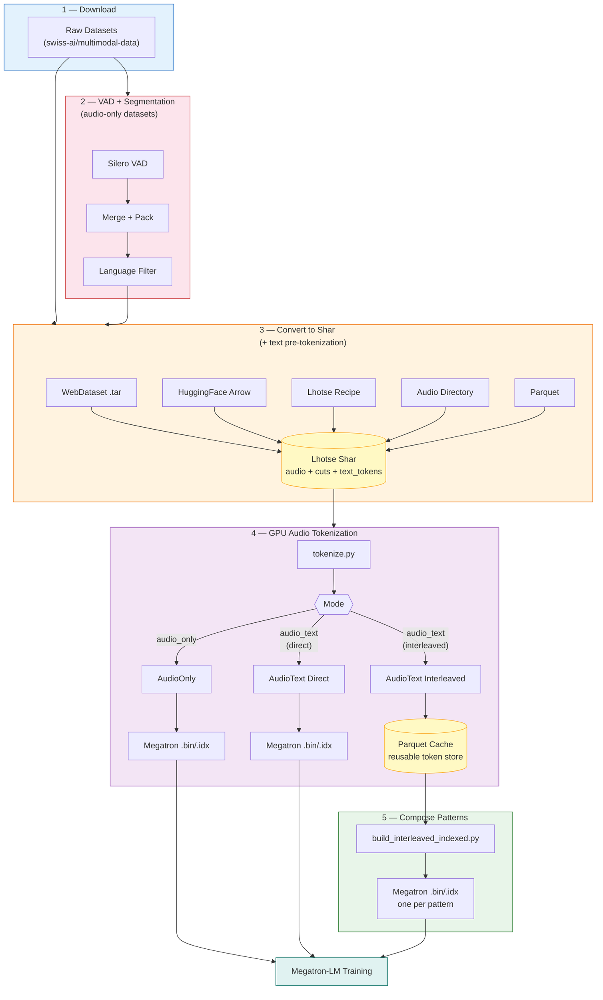
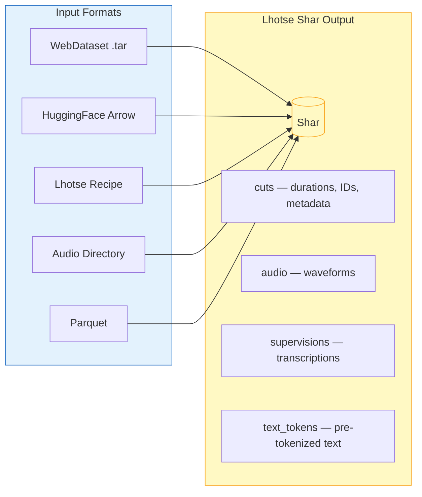
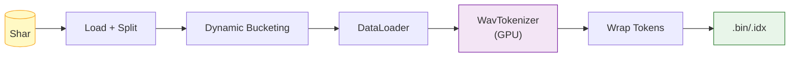
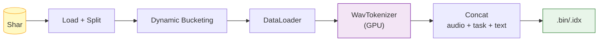
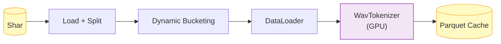
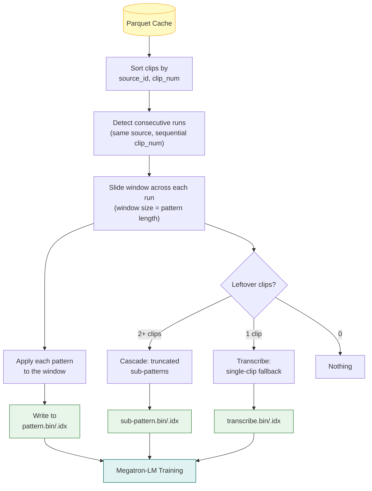
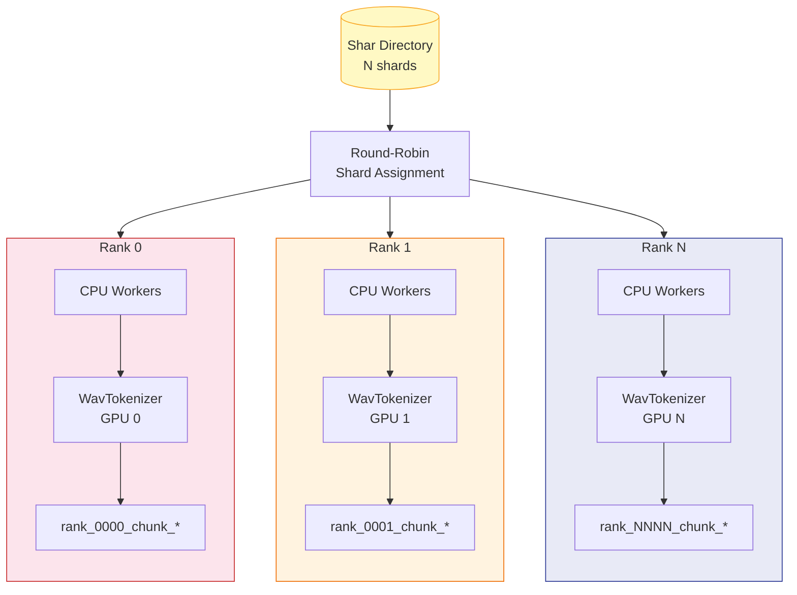

# Audio Tokenization Pipeline — Architecture Overview

> **TL;DR** — Download raw audio datasets, preprocess with VAD (audio-only) or use pre-segmented data (audio-text), convert everything to Lhotse Shar, tokenize audio on GPUs, and output Megatron-compatible `.bin/.idx` for training. The interleaved path caches tokens to Parquet so you can cheaply compose different cross-clip interleaving patterns without re-tokenizing.

---

## 1. End-to-End Pipeline

The pipeline spans two repositories: dataset downloading ([multimodal-data](https://github.com/swiss-ai/multimodal-data/tree/data-pipeline/adapter)) and tokenization (this repo). All paths produce Megatron `.bin/.idx` files for training.



---

## 2. VAD + Segmentation (Audio-Only Datasets)

Unsupervised datasets (e.g. VoxPopuli, People's Speech) contain long recordings with silence. Before converting to Shar:

| Step | Script | What it does |
|------|--------|-------------|
| **Silero VAD** | [`run_vad.py`](./utils/prepare_data/run_vad.py) | Detect speech timestamps per recording |
| **Merge + Pack** | [`chunking.py`](./utils/prepare_data/chunking.py) | Merge segments when gap < `max_merge_gap_sec`, pack into chunks up to `max_chunk_sec`, drop chunks < `min_chunk_sec` |
| **Language Filter** | [`filter_langid_vad.py`](./utils/prepare_data/filter_langid_vad.py) | Keep only target languages, produce per-shard VAD JSONL |

Audio-text datasets (e.g. Emilia, WenetSpeech) are already segmented with transcriptions and skip this step.

> **Dry run:** Sweep VAD parameters and estimate hours/tokens per configuration with [`vad_sweep.py`](./utils/prepare_data/stats/vad_sweep.py) — no files written.
>
> ```bash
> python -m audio_tokenization.utils.prepare_data.stats.vad_sweep \
>     --vad-dir /path/to/vad_results \
>     --min-chunk-sweep 1,5,10,20,30 \
>     --token-rate 40 --num-workers 32
> ```

---

## 3. Convert to Shar

All input formats converge into **Lhotse Shar** before tokenization. Each converter is a standalone script under [`utils/prepare_data/`](./utils/prepare_data/).

**Text pre-tokenization happens here** (via `--text_tokenizer`): the Shar stores `text_tokens` per cut, so the GPU tokenization step only handles audio.



---

## 4. GPU Audio Tokenization

All modes share the same data loading pipeline ([`data.py`](./pipelines/lhotse/data.py)): load Shar, split shards across ranks, dynamic bucketing by duration, multi-worker CPU decoding, GPU tokenization with WavTokenizer.

> **`trim_last_tokens`** — Batched GPU tokenization zero-pads shorter waveforms to the longest in the batch. We observed that zero-padded vs. non-padded audio produces identical tokens except for the last few positions (artifacts of the padding boundary). The `trim_last_tokens` config (default 5) strips these trailing tokens from any sample that was padded, so outputs match single-sample tokenization. See [`audio_only.py`](./vokenizers/wavtokenizer/audio_only.py).

### Mode A: Audio-Only

[`audio_only.py`](./pipelines/lhotse/audio_only.py) — Encode waveforms into discrete tokens, wrap with structure tokens, write Megatron micro-shards.



```
Output: [BOS] [audio_start] tok_0 ... tok_N [audio_end] [EOS]
```

### Mode B: Audio-Text Direct

[`audio_text.py`](./pipelines/lhotse/audio_text.py) with `audio_text_format: direct` — Concatenate audio tokens + task token + text tokens into a single sequence.



```
Output: [BOS] [audio_start] audio_toks [audio_end] [task] text_toks [EOS]
```

### Mode C: Audio-Text Interleaved (Two-Stage)

The interleaved path separates the expensive GPU tokenization (Stage 1) from the cheap CPU-only pattern composition (Stage 2), so you can experiment with different interleaving strategies without re-tokenizing.

---

## 5. What is Cross-Clip Interleaving?

Speech data is inherently multimodal: the same spoken content produces completely different token sequences depending on the modality — discrete audio tokens from WavTokenizer (variable-length, acoustic) vs. text tokens from a text tokenizer (short, semantic). **Interleaving** arranges these two representations from *different* temporal positions within a recording into a single training sequence:

```
Aligned timeline (one recording, 8 clips of ~5s each):

  Text:   T1    T2    T3    T4    T5    T6    T7    T8
  Audio:  A1    A2    A3    A4    A5    A6    A7    A8
          |     |     |     |     |     |     |     |
  Time:   0s    5s    10s   15s   20s   25s   30s   35s

  Each clip has BOTH audio tokens and text tokens for the same content.
  A pattern selects which representation to use at each position.
```

**Bidirectional interleaving** (ATAT + TATA) creates two complementary views of the same recording:

```
  Audio-first (ATAT):  A1 → T2 → A3 → T4 → A5 → T6 → ...
                        ↑         ↑         ↑
                      audio     audio     audio    (odd positions)
                             ↑         ↑
                           text      text          (even positions)

  Text-first  (TATA):  T1 → A2 → T3 → A4 → T5 → A6 → ...
                        ↑         ↑         ↑
                      text      text      text     (odd positions)
                             ↑         ↑
                           audio     audio         (even positions)
```

| Property | Benefit |
|----------|---------|
| **Full coverage** | Every temporal position appears as both audio and text across the two patterns |
| **Bidirectional alignment** | Model learns audio-to-text *and* text-to-audio prediction |
| **2x training signal** | Two complementary sequences from a single recording |

### Design Dimensions

- **Sequence length** — How many clips per training sequence (L=4, 8, 16, 32). Longer sequences give more context but cost more memory.
- **Audio granularity** — Concatenate adjacent audio clips to vary the audio-to-text ratio. E.g. `AAT` uses 2 audio clips before each text position, trading fine-grained alignment for richer acoustic context.
- **Unimodal baselines** — `AAAA` (audio-only) and `TTTT` (text-only) patterns from the same Parquet cache for controlled ablation.

### References

- [Scaling Speech-Text Pre-training with Synthetic Interleaved Data](http://arxiv.org/abs/2411.17607) (Zeng et al., 2024)
- [SLAMMING: Training a Speech Language Model on One GPU in a Day](http://arxiv.org/abs/2502.15814) (Maimon et al., 2025)
- [Kimi-Audio Technical Report](https://arxiv.org/abs/2504.18425) (KimiTeam, 2025)
- [Voxtral](https://arxiv.org/abs/2507.13264) (Liu et al., 2025)

---

## 6. Interleaved Pipeline — Implementation

### Stage 1: Tokenize to Parquet Cache (GPU)

[`audio_text.py`](./pipelines/lhotse/audio_text.py) with `audio_text_format: interleaved` — Tokenize audio on GPU, pair with pre-tokenized text, write per-clip rows to Parquet.



Each Parquet row stores one clip:

| Column | Description |
|--------|-------------|
| `clip_id` | Unique clip identifier |
| `source_id` | Source recording / utterance group |
| `clip_num` | Sequential position within source |
| `speaker` | Speaker identifier |
| `duration` | Audio duration (seconds) |
| `text` | Raw transcription |
| `text_tokens` | Pre-tokenized text (int32 list) |
| `audio_tokens` | WavTokenizer output (int32 list) |
| `dataset` | Dataset name |

### Stage 2: Compose Patterns (CPU-only)

[`build_interleaved_indexed.py`](./utils/build_interleaved_indexed.py) reads the Parquet cache and assembles training sequences. **No GPU needed** — re-run with different `--patterns` to experiment instantly.



> **Dry run:** Pass `--dry-run` to preview per-pattern statistics (sequence counts, token counts, estimated `.bin` size, length distributions) without writing files.

---

### Worked Example

A podcast episode with 9 clips, `--patterns ATAT TATA`:

**Step 1 — Detect runs.** Consecutive `clip_num` values from the same `source_id` form a run:

```
Source: podcast_ep42    →  one run of 9 clips: [c0, c1, c2, c3, c4, c5, c6, c7, c8]
```

**Step 2 — Slide windows.** Pattern length = 4, so window size = 4:

```
Window 1:  [c0, c1, c2, c3]
Window 2:  [c4, c5, c6, c7]
Remainder: [c8]              ← doesn't fill a window
```

**Step 3 — Apply patterns.** Each character maps a clip to a modality (`A` = audio tokens, `T` = text tokens). A `[switch]` token is inserted at every A-to-T transition:

```
ATAT on [c0, c1, c2, c3]:
         A       T       A       T
  → [BOS, audio(c0), switch, text(c1), audio(c2), switch, text(c3), EOS]

TATA on [c0, c1, c2, c3]:
         T       A       T       A
  → [BOS, text(c0), audio(c1), switch, text(c2), audio(c3), EOS]
```

**Step 4 — Handle remainder.** 1 clip left → `transcribe` fallback:

```
[BOS, audio(c8), speech_transcribe, text(c8), EOS]  →  transcribe.bin/.idx
```

For 2-3 leftover clips, **cascade sub-patterns** (truncated prefixes) handle them:

```
Main patterns:     ATAT, TATA  (window=4)
Cascade (size 3):  ATA,  TAT   (first 3 chars)
Cascade (size 2):  AT,   TA    (first 2 chars)
Single-clip:       transcribe
```

### Pattern Reference

| Pattern | Clips | Output Sequence |
|---------|-------|-----------------|
| `AT` | 2 | `[BOS] A(c0) [switch] T(c1) [EOS]` |
| `TA` | 2 | `[BOS] T(c0) A(c1) [EOS]` |
| `ATAT` | 4 | `[BOS] A(c0) [switch] T(c1) A(c2) [switch] T(c3) [EOS]` |
| `TATA` | 4 | `[BOS] T(c0) A(c1) [switch] T(c2) A(c3) [EOS]` |
| `AAT` | 3 | `[BOS] A(c0) A(c1) [switch] T(c2) [EOS]` |
| `AAAA` | 4 | `[BOS] A(c0) A(c1) A(c2) A(c3) [EOS]` (audio-only baseline) |
| `TTTT` | 4 | `[BOS] T(c0) T(c1) T(c2) T(c3) [EOS]` (text-only baseline) |

- **A** = audio tokens for that clip (`[audio_start] ... [audio_end]`)
- **T** = text tokens for that clip
- **[switch]** = `<|speech_switch|>` token, only at A-to-T transitions

### CLI Usage

```bash
# Stage 1: Tokenize once (expensive, GPU)
python -m audio_tokenization.tokenize \
    mode=audio_text audio_text_format=interleaved num_gpus=4

# Stage 2: Compose patterns (cheap, CPU-only — re-run as many times as you want)
python -m audio_tokenization.utils.build_interleaved_indexed \
    --parquet-dir /path/to/parquets \
    --output-dir /path/to/output \
    --tokenizer-path /path/to/omni_tokenizer \
    --patterns ATAT TATA

# Try different patterns — no re-tokenization needed
python -m audio_tokenization.utils.build_interleaved_indexed \
    --parquet-dir /path/to/parquets \
    --output-dir /path/to/output_v2 \
    --tokenizer-path /path/to/omni_tokenizer \
    --patterns ATATAT TATATA AAT

# Dry run — preview statistics only
python -m audio_tokenization.utils.build_interleaved_indexed \
    --parquet-dir /path/to/parquets \
    --output-dir /tmp/dry \
    --tokenizer-path /path/to/omni_tokenizer \
    --patterns ATAT TATA \
    --dry-run
```

---

## 7. Configuration (Hydra)

The pipeline uses [Hydra](https://hydra.cc/) for hierarchical configuration. The main config composes a dataset sub-config via the `defaults` list, and every field can be overridden from the CLI.

```
configs/
├── config.yaml                       # Main: mode, tokenizer, W&B, resume
└── dataset/
    ├── audio_only/
    │   ├── audioset.yaml             # AudioSet (unsupervised)
    │   ├── voxpopuli.yaml
    │   ├── commonvoice.yaml
    │   ├── suno.yaml
    │   └── ...
    └── audio_text/
        ├── emilia_yodas_interleaved.yaml
        ├── wenetspeech_interleaved.yaml
        └── ...
```

**Main config** ([`config.yaml`](./configs/config.yaml)):

| Key | Description |
|-----|-------------|
| `mode` | `audio_only` or `audio_text` |
| `audio_text_format` | `direct` (Megatron) or `interleaved` (Parquet) |
| `audio_text_task` | `transcribe` or `annotate` |
| `tokenizer.path` | Path to omni-tokenizer (with audio tokens added) |
| `tokenizer.sampling_rate` | Target sample rate for decoding (default 24000) |
| `tokenizer.trim_last_tokens` | Trailing tokens to trim from padded audio (default 5) |
| `num_gpus` | Total GPU count (cross-checked against `SLURM_NTASKS`) |
| `resume` | Resume from rank checkpoints |
| `wandb.*` | Weights & Biases logging settings |

**Dataset configs** — each specifies Shar paths, filtering, bucketing, and DataLoader settings:

| Key | Description |
|-----|-------------|
| `shar_dir` | Path(s) to pre-built Shar directories |
| `min_duration` / `max_duration` | Duration filtering (seconds) |
| `max_batch_duration` | Dynamic bucketing target (seconds of audio per batch) |
| `num_buckets` | Number of duration buckets for balanced batching |
| `num_workers` / `prefetch_factor` | DataLoader parallelism |
| `checkpoint_interval_batches` | How often to write rank checkpoints |

```bash
# Override from CLI
python -m audio_tokenization.tokenize \
    dataset=audio_text/emilia_yodas_interleaved \
    mode=audio_text audio_text_format=interleaved \
    num_gpus=8 tokenizer.trim_last_tokens=0
```

---

## 8. Multi-GPU Distribution

Each rank processes an independent shard subset — no NCCL, no inter-rank communication. See [`core.py`](./pipelines/lhotse/core.py).


